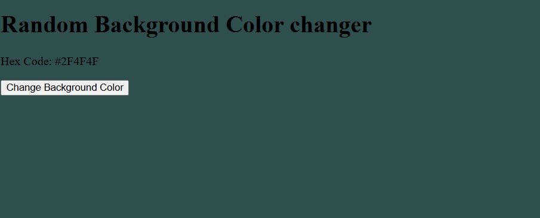

# 🎨 Random Dark Background Color

A simple web project that changes the background color of the page to a random dark color when you click a button. The current color’s HEX code is displayed on the screen.

---

## 📸 Preview

---

## 🚀 Live Demo
You can try it here: [Live on GitHub Pages](https://ajar132.github.io/random-dark-color/)

---

## 🛠️ Technologies Used
- **HTML5** – Structure of the page  
- **CSS3** – Styling (optional)  
- **JavaScript** – Logic for changing colors  
